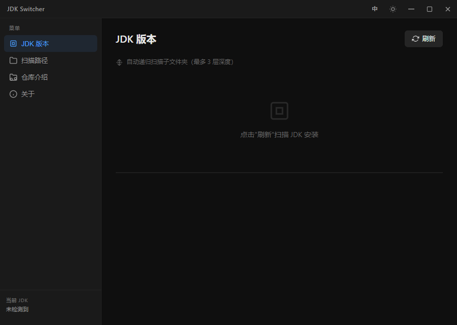
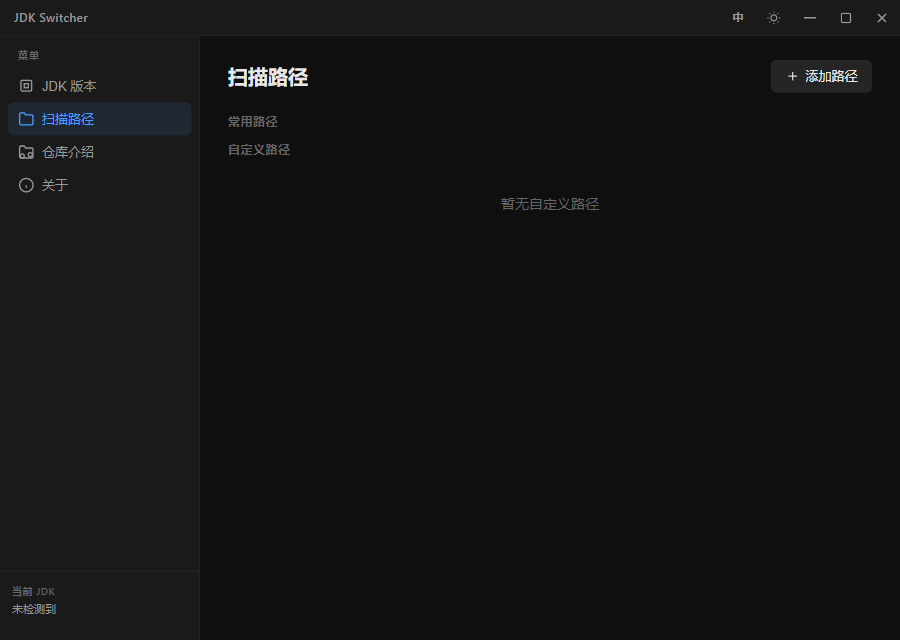
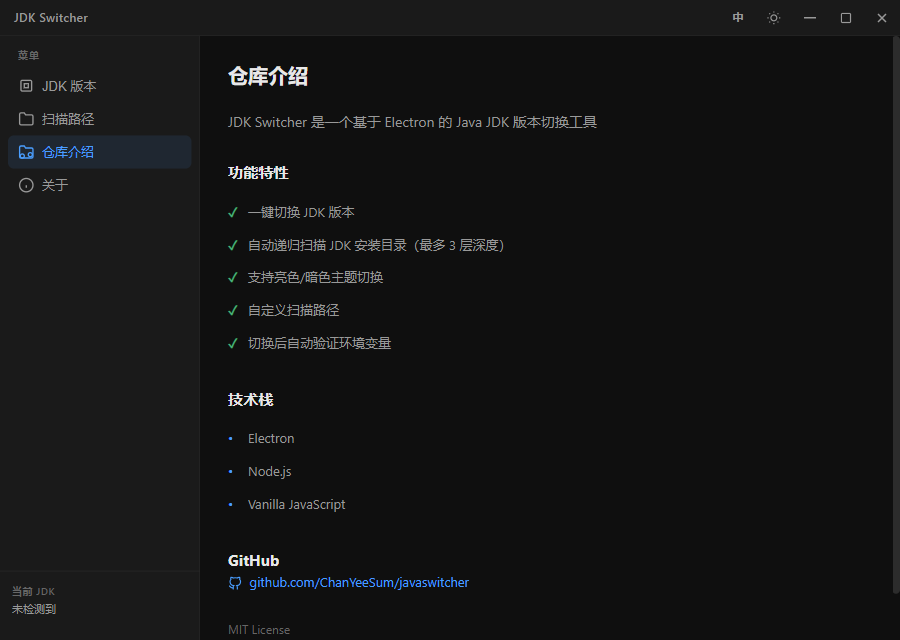
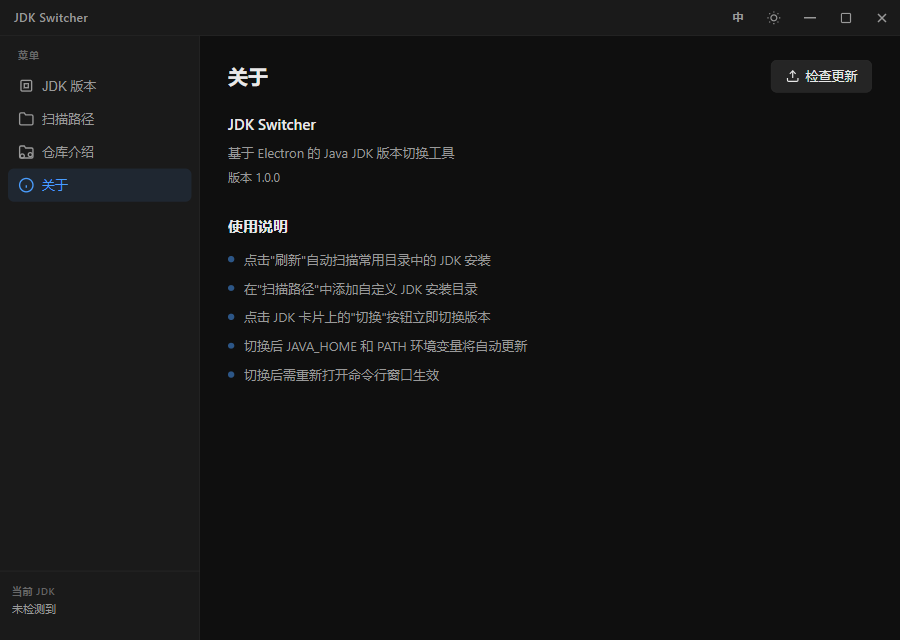

# JDK Switcher

基于 Electron 的 Java JDK 版本切换工具，支持 Windows 系统。

Electron-based Java JDK version switcher tool for Windows.

## 截图 / Screenshots

## 功能特性 / Features

| 中文 | English |
|------|---------|
| 🔄 一键切换 JDK 版本 | 🔄 One-click JDK switching |
| 📁 自动递归扫描 JDK 安装目录（最多 3 层深度） | 📁 Auto recursive scan (max 3 levels) |
| 🎨 亮色/暗色主题切换 | 🎨 Light/Dark theme support |
| 🛠️ 自定义扫描路径 | 🛠️ Custom scan paths |
| ✅ 切换后自动验证环境变量 | ✅ Auto-verify environment variables |
| 🌐 中英文界面切换 | 🌐 Chinese/English UI switch |

## 使用说明 / Usage

| 步骤 | 中文 | English |
|------|------|---------|
| 1 | 点击"刷新"自动扫描常用目录中的 JDK 安装 | Click "Refresh" to scan JDK installations |
| 2 | 在"扫描路径"中添加自定义 JDK 安装目录 | Add custom JDK paths in "Scan Paths" |
| 3 | 点击 JDK 卡片上的"切换"按钮立即切换版本 | Click "Switch" button to switch JDK |
| 4 | 切换后需重新打开命令行窗口生效 | Reopen terminal for changes to take effect |

## 技术栈 / Tech Stack

- **Electron** - 桌面应用框架
- **Node.js** - 运行时环境
- **Vanilla JavaScript** - 前端开发
- **GitHub Actions** - 自动构建与发布

## 下载 / Download

从 [Releases](https://github.com/ChanYeeSum/javaswitcher/releases) 页面下载最新版本：

- `JDK-Switcher-Setup.exe` - Windows 安装程序
- `jdk-switcher-win32-x64-1.0.0.zip` - 便携版 (解压即用)

## 许可证 / License

MIT License